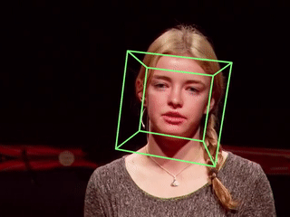
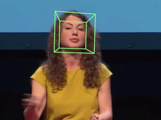

# HeadTracker — HCI Controller

Control your mouse and trigger system commands using only head movements and voice, with no hands required.




## How it works

The system runs three stages on every webcam frame:

1. **Face detection** — SCRFD model produces a bounding box.
2. **Landmark detection** — CNN outputs 68 facial landmarks from the face crop.
3. **Pose estimation** — solvePnP converts landmarks to pitch/yaw/roll.

Frames after the first use Lucas-Kanade optical flow to track the 68 projected model points without re-running the CNN. The CNN only fires again when tracking genuinely fails (too few inliers or high reprojection error). Angles are smoothed with a One Euro Filter and mapped through a precision curve before moving the mouse.

Voice commands run concurrently in a background thread using Vosk (Portuguese model).

## Setup

```bash
git clone https://github.com/Pimenta15/HeadTracker.git
cd HeadTracker
pip install -r requirements.txt
git lfs pull          # download ONNX models and the Vosk model
```

## Running

```bash
# Webcam sem janela (modo normal — sem distrações)
python main.py --cam 0

# Com janela de debug (imagem da webcam + overlay)
python main.py --cam 0 --show

# Arquivo de vídeo
python main.py --video path/to/video.mp4 --show
```

**Teclas (apenas com `--show`):**

| Tecla | Ação |
|-------|------|
| `c` | Recalibrar posição neutra da cabeça |
| `r` | Reiniciar rastreamento |
| `q` / `ESC` | Sair |

Sem `--show`, sair com **Ctrl+C** ou pelo comando de voz `encerrar programa`.

## Voice commands (Portuguese)

Say any of the phrases below. Commands have a 1.2 s cooldown to avoid accidental repeats.

| Phrase | Action |
|--------|--------|
| `abre navegador` | Open browser (Google) |
| `fechar janela` | Close current window |
| `screenshot` | Save screenshot to Desktop |
| `som` / `abaixa` | Volume up / down (×5) |
| `março` | Mute |
| `copiar` / `colar` / `desfazer` | Ctrl+C / Ctrl+V / Ctrl+Z |
| `rolar cima` / `rolar baixo` | Scroll up / down |
| `minimizar` | Minimize window |
| `abrir terminal` | Open terminal |
| `show` / `sou` | Left click |
| `fato` | Right click |
| `colo` / `joia` | Mouse hold / release |
| `aumenta` / `diminui` | Zoom in / out |
| `troca` | Win+Tab (window switcher) |
| `zero` | Reset completo: reinicia rastreamento e recalibra centro |
| `encerrar` | Encerrar HeadTracker |

## Project structure

```
HeadTracker/
├── headtracker/
│   ├── tracking/
│   │   ├── face_detection.py   SCRFD face detector
│   │   ├── mark_detection.py   68-point CNN landmark detector
│   │   ├── pose_estimation.py  PnP solver
│   │   ├── tracker.py          HeadTracker — LK + PnP hybrid loop
│   │   └── utils.py            Box refinement helper
│   ├── control/
│   │   ├── cursor.py           CursorController — angle → mouse
│   │   └── filters.py          OneEuroFilter, precision curve, soft deadzone
│   ├── voice/
│   │   ├── engine.py           VoiceCommandEngine (Vosk)
│   │   └── commands.py         Command actions and vocabulary
│   └── calibration.py          Load / save calibration.json
├── assets/                     ONNX models + Vosk model (Git LFS)
├── tools/
│   └── testa_cameras.py        Enumerate available cameras
└── main.py                     Entry point
```

## Calibration

Neutral position is captured automatically on the first detected frame. Press `c` to recalibrate at any time. The calibration (neutral pitch/yaw and angle ranges) is persisted in `calibration.json` and loaded on the next run.

## License

MIT — see [LICENSE](LICENSE).

This project builds on:
- [yinguobing/head-pose-estimation](https://github.com/yinguobing/head-pose-estimation) — original landmark pipeline (MIT)
- [InsightFace SCRFD](https://github.com/deepinsight/insightface/tree/master/detection/scrfd) — face detector
- [alphacep/vosk](https://alphacephei.com/vosk/) — offline speech recognition
- [OpenFace](https://github.com/TadasBaltrusaitis/OpenFace) — 3D face model points
